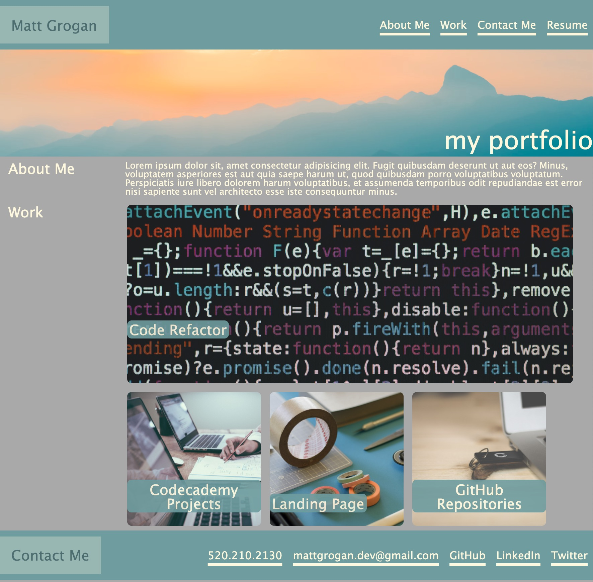

  

<h3 align="center">Professional Portfolio</h3>

---

 Professional Portfolio website that showcases my projects with links and contact info.
      

## 🧐 About 

For this project I created a professional portfolio website. This website contains an intro/about-me section, photos with links that go to my projects, and a contact-me section. I used the various CSS tools that we have learned during class so far in order to create this and worked on appropriate naming conventions in HTML for them to link properly.

## 🎈 Usage 

Kindly scroll through the website and enjoy my professional portfolio. Please click any project that interests you to find out more info.

## 🚀 Deployment 

Deployed this website using GitHub pages. In order to do this I went to settings, scrolled down to GitHub pages, and selected the "master branch".

## ⛏️ Built Using 

- # HTML
- # CSS

## 🎉 Acknowledgements 

- 🏆 Google and notes from class throughout the week.

## 🔗 Link to deployed website

-

## 🖼️ Image of final website

